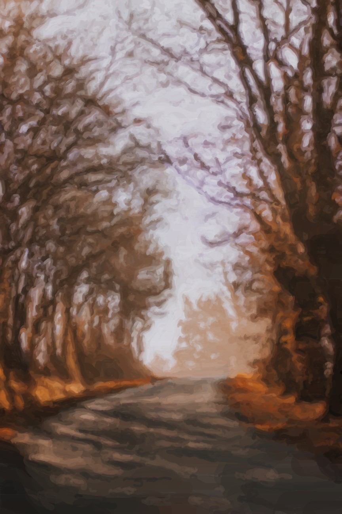

# SimplePainterlyRendering
Processing implementation of the algotihm propose by Hertzmann et al.: 

Aaron Hertzmann. 1998. Painterly rendering with curved brush strokes of multiple sizes. In Proceedings of the 25th annual conference on Computer graphics and interactive techniques (SIGGRAPH '98). ACM, New York, NY, USA, 453-460. DOI: https://doi.org/10.1145/280814.280951 

## Example:

Input image (Photo by Mat Reding on Unsplash)| Painterly rendered image produced by the algorithm
:-------------------------:|:-------------------------:
  |  

